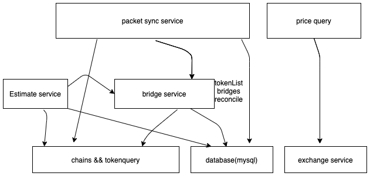

# teleport-data-analytics

## relation chart


## Run

```bash
git clone https://github.com/teleport-network/teleport-data-analytics.git  &&  cd teleport-data-analytics
make install
# please confirm teleport-height,eth-height and bsc-height
teleport-data-analytics start -c config.toml 
```

default port: 8080

### APIs

* Get all chains
  > GET /bridge/chains
* Get counterparty chains
  > GET /bridge/counterpartyChains/{chainId}
* Get tokens with two chains
  > GET /bridge/bridges/{srcChainId}/{destChainId}
* Get cross chain history
  > Post /bridge/packet/history
* Get start sync
  > Post /bridge/packet/sync/start
* Get start sync
  > Post /bridge/packet/sync/start
